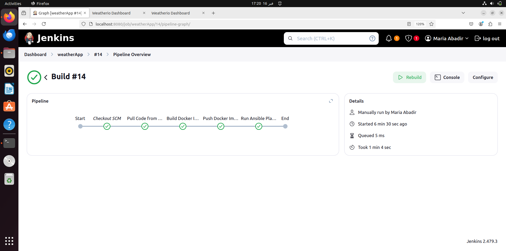
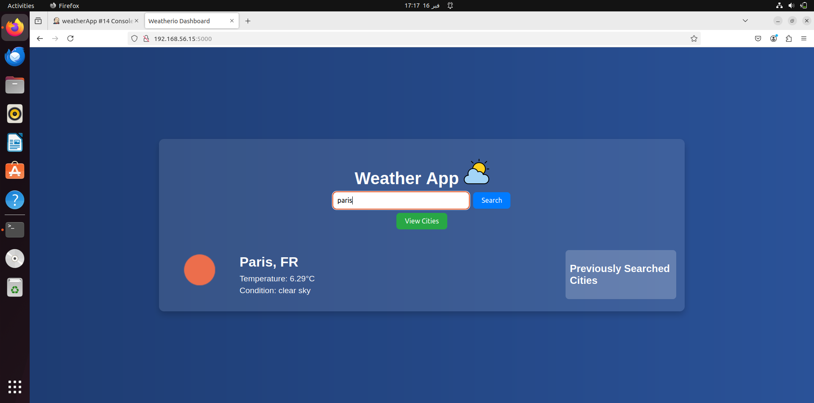
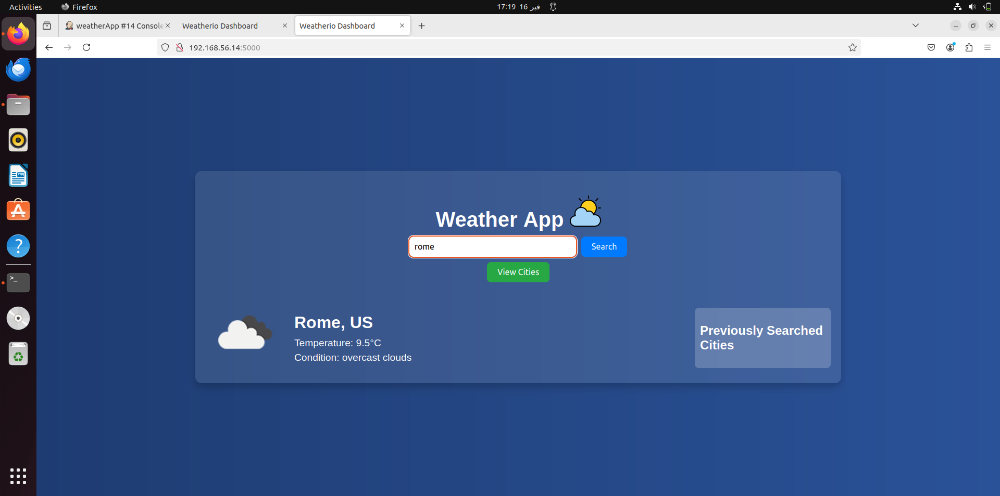

# Weather-App

## Description

This **Weather App Deployment** project automates the deployment of a Python-based weather application using **Jenkins, Docker, Ansible, and Vagrant**. The pipeline ensures that the application is **containerized**, pushed to **Docker Hub**, and deployed on two **Vagrant virtual machines** using **Ansible**.

## Project Overview

This CI/CD pipeline automates the following steps:

- **Pulls** the Python application from a **private GitHub repository**.
- **Builds** a **Docker image** of the application.
- **Pushes** the image to **Docker Hub**.
- **Deploys** using **Ansible**, which:
  - **Installs Docker** on the target Vagrant machines.
  - **Pulls the latest Docker image** from Docker Hub.
  - **Runs the container** on both machines.

## Technologies Used

- **Jenkins** – Automates the pipeline execution.
- **Docker** – Containerizes the Python application.
- **Vagrant** – Creates virtual machines for deployment.
- **Ansible** – Automates software installation and deployment.
- **GitHub** – Hosts the application and **Dockerfile**.
- **Docker Hub** – Stores the built Docker image.

## Verification

Once the pipeline completes:

    1- Run docker ps on both machines to confirm the container is running.
    2- Open a browser and visit:
       http://192.168.56.14:5000
       http://192.168.56.15:5000
    3- You should see the Weather App UI.

## Conclusion

This pipeline automates the end-to-end deployment of a Python weather application using Jenkins, Docker, Ansible, and Vagrant. It ensures smooth delivery from code commit to running application containers on multiple machines.

## Output

**Screenshots from the pipeline execution and deployment:**

